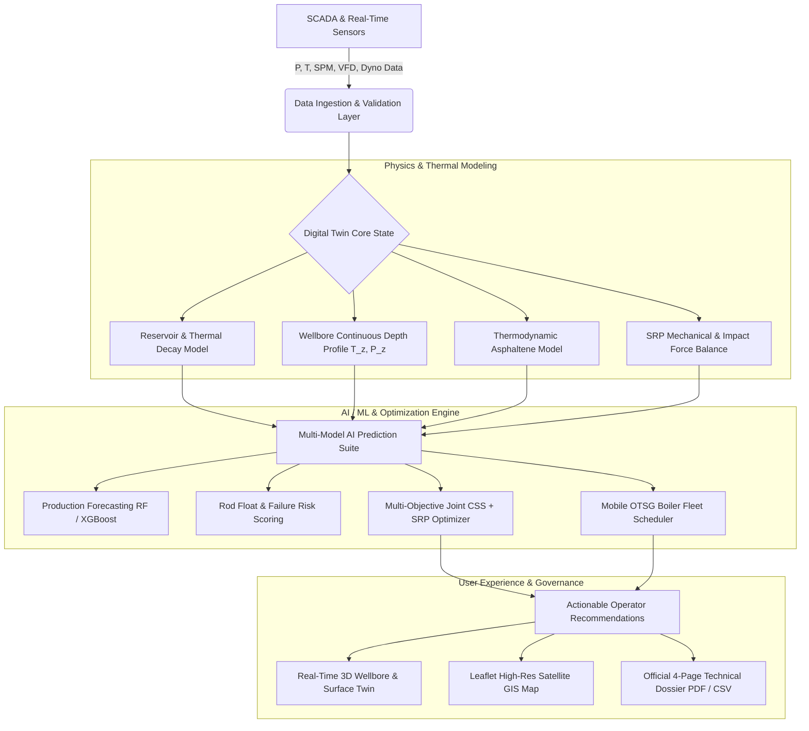

# 🛢️ Baghewala Heavy-Oil Digital Twin (CSS + SRP Well-to-Surface Optimization)

> **AI-Enabled Well-to-Surface Digital Twin for Joint Cyclic Steam Stimulation (CSS) and Sucker Rod Pump (SRP) Optimization on Baghewala Field Heavy-Oil Wells (Oil India Limited).**

[](https://fastapi.tiangolo.com)
[](https://vitejs.dev)
[](https://threejs.org)
[](https://leafletjs.com)
[](https://python.org)

---

## 📌 Executive Summary & Problem Context

The **Baghewala Heavy Oil Field** (Bikaner-Nagaur Basin, Thar Desert, Rajasthan, India) contains extraordinary ultra-heavy crude (**16°–19° API**) trapped at shallow depths (~900–1,150 m) in the Proterozoic Jodhpur Sandstone. At original reservoir temperature (~42°–48°C), in-situ crude viscosity exceeds **4,500–10,000 cP**, making primary cold recovery impossible.

**Thermal Enhanced Oil Recovery (EOR) via Cyclic Steam Stimulation (CSS)** heats the matrix to ~190°C–280°C to reduce oil viscosity to <45 cP for artificial lift via **Sucker Rod Pumps (SRP)**. However, post-injection reservoir cooling creates a complex thermal-mechanical coupling:

$$\text{Reservoir Cooling} \longrightarrow \mu_{\text{oil}} \uparrow \longrightarrow \text{Mobility} \downarrow \longrightarrow \text{Flow Resistance} \uparrow \longrightarrow \text{Rod Load} \uparrow \longrightarrow \text{Rod Floating Risk} \uparrow \longrightarrow \text{Failure Risk} \uparrow$$

**Optimizing CSS and SRP independently leads to severe sub-optimality:**
- Excess steam injection wastes massive energy and accelerates thermal casing fatigue.
- Running SRP at standard speeds during cool-down causes downstroke rod floating, buckling, impact shock loading, and unsetting of the pump.

This platform bridges reservoir physics, wellbore thermodynamics, rod string mechanics, and machine learning into an **integrated, real-time, constraint-aware decision-support twin**.

---

## 🏛️ System Architecture



---

## 📂 Repository Structure

```tree
d:/sih/
├── backend/                             # FastAPI Backend Service
│   ├── app/
│   │   ├── api/                         # REST & WebSocket API Routers
│   │   │   └── v1/
│   │   │       ├── advanced_twin.py     # Dynacards, mechanics, depth profile, economics, fleet
│   │   │       ├── anomalies.py         # Multivariate anomaly detection & classification
│   │   │       ├── auth.py              # Role-Based Access Control (RBAC) & authentication
│   │   │       ├── css.py               # CSS cycle history & optimization
│   │   │       ├── digital_twin.py      # Core digital twin state estimation
│   │   │       ├── failure_risk.py      # Failure risk scoring & decomposition
│   │   │       ├── predictions.py       # AI model prediction endpoints
│   │   │       ├── production.py        # Production history & decline forecasting
│   │   │       ├── recommendations.py   # Operator advisory feedback loop
│   │   │       ├── srp.py               # SRP monitoring, setpoints & dyno analysis
│   │   │       └── wells.py             # 37-well field inventory & pad registration
│   │   ├── core/                        # Configuration & logging settings
│   │   ├── db/                          # Database session & SQLAlchemy ORM models
│   │   │   ├── models.py                # Well, Reservoir, SRP, CSSCycle, Production, Failure
│   │   │   └── session.py               # SQLite/PostgreSQL connection & well resolution
│   │   ├── ml/                          # Pre-trained ML pipelines & inference models
│   │   ├── physics/                     # First-principles mechanical & thermal physics
│   │   │   ├── dyno_cards.py            # Surface & downhole pump dynamometer card generation
│   │   │   ├── economics_and_fleet.py   # Lifting cost economics & mobile boiler dispatch
│   │   │   ├── mechanics_advanced.py    # Impact shock loading & sinker bar sizing formulas
│   │   │   ├── srp_mechanics.py         # PPRL, MPRL, rod stress & float risk equations
│   │   │   └── thermal_advanced.py      # T(z) depth profiles, asphaltene envelope, cut-off
│   │   ├── schemas/                     # Pydantic v2 domain schemas & validation
│   │   └── main.py                      # FastAPI entrypoint, middleware, and CORS
│   └── requirements.txt                 # Python dependencies
│
├── frontend/                            # React 18 + Vite Web Application
│   ├── src/
│   │   ├── components/
│   │   │   ├── alerts/                  # AnomalyAlertCenter & real-time notifications
│   │   │   ├── analytics/               # HistoricalAnalysis & Field-wide Production Matrix
│   │   │   ├── dashboard/
│   │   │   │   ├── BaghewalaSatelliteMap.jsx # High-res Google Satellite GIS with 37 wells
│   │   │   │   └── satellite_map.css    # Scoped GIS overlay, fullscreen & HUD styles
│   │   │   ├── digital_twin_viz/        # Three.js 3D Well-to-Surface Digital Twin & What-If
│   │   │   ├── health_monitoring/       # RodPumpHealth & Predictive Maintenance RUL
│   │   │   ├── optimization/            # CSSOptimizer, SRPOptimizer, SteamEnergyEconomics
│   │   │   └── reports/                 # TechnicalDossier & Official 4-page PDF generator
│   │   ├── services/
│   │   │   ├── api.js                   # Centralized API service with fallback resiliency
│   │   │   └── pdfReportGenerator.js    # jsPDF vector-based technical dossier generator
│   │   ├── App.jsx                      # Main dashboard layout, header selector, navigation
│   │   ├── index.css                    # Sandstone & desert themed industrial design tokens
│   │   └── main.jsx                     # React DOM bootstrap
│   ├── package.json                     # Frontend dependencies & scripts
│   └── vite.config.js                   # Vite configuration & backend proxy
│
├── data/                                # Production, CSS, and telemetry datasets
│   └── baghewala_css_srp_integrated_dataset.csv # Integrated field dataset
├── models/                              # Serialized ML models (Random Forest, Gradient Boosting)
├── docker/                              # Dockerfile & Docker Compose configurations
├── notebooks/                           # Exploration, EDA, and model training notebooks
├── PROJECT_CONTEXT.md                   # Full SRS v1.0 specifications & engineering reference
└── README.md                            # Comprehensive project guide (this document)
```

---

## ⚡ Key Features & Engineering Modules

### 1. 🛰️ High-Resolution Satellite GIS & Field Topography
- **Google Maps Satellite Hybrid Imagery:** Ultra-sharp optical coverage over Thar Desert (27.5°N, 71.9°E).
- **All 37 Field Wells Mapped:**
  - `Pad-NK` (North Heavy Oil Cluster): `NK-07`, `NK-68`, `NK-75`, `NK-76`, `NK-82`, `NK-91`, `NK-93`
  - `Pad-1` (North-Jodhpur Sector): `B-01` to `B-06`
  - `Pad-2` (Central-GGS Sector): `B-07` to `B-12`
  - `Pad-3` (South-Extension Sector): `B-13` to `B-18`
  - `Pad-4` (East-Sandstone Sector): `B-19` to `B-24`
  - `Pad-5` (Deep Jodhpur Sector): `B-25` to `B-30`
- **Dynamic Infrastructure Overlays:** 52.4 km² lease boundary, production gathering flowlines, high-pressure steam distribution trunklines, Central Processing Facility (CPF / GGS), 4x Once-Through Steam Generators (OTSG), and crude storage battery.
- **One-Click Fullscreen View:** Full-viewport interactive map mode with keyboard shortcut (<kbd>ESC</kbd>) and re-centering actions.

### 2. 🧬 3D Well-to-Surface Digital Twin & What-If Simulation
- **Surface Unit:** Real-time 3D sucker rod beam pumping unit showing kinematic walking beam motion, polished rod stroke, and horsehead velocity.
- **Downhole Wellbore Mechanics:** Full depth string visualization showing sucker rods, sinker bars, tubing, traveling valve, standing valve, and casing perforations.
- **Thermodynamic Flow:** Live representation of steam plume radius ($R_s$), thermal front propagation, and viscosity decay over distance.
- **Interactive What-If Simulation:** Test candidate steam volume, soak hours, SPM, stroke length, and VFD frequency before deploying to the field.

### 3. 📊 Dynamometer Card Diagnostics & Rod Mechanics
- **Surface & Downhole Pump Cards:** Real-time calculation of dynacards with pattern recognition (Normal, Fluid Pound, Gas Interference, Heavy Fluid Friction, Tubing Movement).
- **Rod Floating & Impact Force Balance:** Evaluates net downstroke acceleration vs. fluid drag resistance:
  $$F_{\text{net, down}} = W_{\text{buoyant}} - F_{\text{drag}} - F_{\text{friction}}$$
- **Sinker Bar Sizing Tool:** Automatically sizes tungsten/lead heavy sinker bars to maintain Minimum Polished Rod Load ($\text{MPRL} \ge 14\text{ kN}$) and eliminate compressive rod buckling in viscous crude.

### 4. 🌡️ Wellbore Continuous Depth Profile & Asphaltene Envelope
- **Continuous $T(z), P(z), \mu(z)$:** Solves steady-state enthalpy and momentum equations from surface wellhead to bottomhole sandface (~1,050 m).
- **Asphaltene Deposition Risk:** Evaluates de Boer & Hirschberg thermodynamic onset criteria to flag wellbore depths where crude cooling triggers organic solid precipitation.

### 5. 🤖 Constrained Joint CSS + SRP Multi-Objective Optimization
- **CSS Parameter Optimization:** Computes Pareto-optimal steam volume (tonnes), injection pressure (bar), soak duration (days), and economic production cut-off date to minimize Cumulative Steam-Oil Ratio (CSOR).
- **SRP Parameter Optimization:** Automatically selects optimal SPM, stroke length, and VFD frequency to maximize gross fluid displacement while preventing rod float ($<5\%$).
- **Mobile Boiler Fleet Dispatch:** Dispatches 4x 30 TPH mobile steam generators between multi-well pads based on reservoir cooling thresholds and production readiness.

### 6. 📑 Automated 4-Page Technical Dossier PDF Export
- Generates official Oil India Limited standard 4-page engineering dossiers:
  - **Page 1:** Field Overview, Executive Summary, Geological Context, Shift Highlights.
  - **Page 2:** Detailed Well Telemetry, Surface & Downhole Dynacards, Mechanical Health.
  - **Page 3:** Multi-Cycle CSS Historical Ledger, SOR Trajectory, Economics ($\text{INR/bbl}$).
  - **Page 4:** AI Multi-Model Registry, Feature Importances, Governance Sign-off.

---

## 🚀 Getting Started (Local Development)

### Prerequisites
- **Node.js** (v18+) & **npm**
- **Python** (3.11 or 3.12)
- **Git**

---

### 1. Clone the Repository
```bash
git clone https://github.com/your-org/baghewala-digital-twin.git
cd baghewala-digital-twin
```

---

### 2. Backend Setup
```bash
cd backend

# Create and activate virtual environment
python -m venv venv
# Windows:
.\venv\Scripts\activate
# Linux/macOS:
# source venv/bin/activate

# Install dependencies
pip install -r requirements.txt

# Start FastAPI server
uvicorn app.main:app --host 127.0.0.1 --port 8000 --reload
```
* Backend Swagger API Docs: **http://127.0.0.1:8000/docs**
* API Health Probe: **http://127.0.0.1:8000/api/health**

---

### 3. Frontend Setup
```bash
cd ../frontend

# Install dependencies
npm install

# Start Vite dev server
npm run dev
```
* Frontend Dashboard: **http://localhost:5173**

---

### 4. Docker Deployment
```bash
docker compose -f docker/docker-compose.yml up --build
```

---

## 📡 Key API Endpoints Reference

| Category | Endpoint | Method | Description |
|---|---|---|---|
| **System** | `/api/health` | `GET` | System liveness probe |
| **Wells** | `/api/wells` | `GET` | List all 37 Baghewala field wells |
| **Wells** | `/api/wells/{id}` | `GET` | Get single well specifications |
| **Digital Twin** | `/api/wells/{id}/digital-twin/state` | `GET` | 4-layer physics & thermodynamic state |
| **Dynacard** | `/api/wells/{id}/dyno-card` | `GET` | Surface and downhole pump dynacard data |
| **Mechanics** | `/api/wells/{id}/mechanics/impact-and-unsetting`| `GET` | Impact shock load & force balance |
| **Sinker Bar** | `/api/wells/{id}/mechanics/sinker-bar-sizing` | `POST` | Size sinker bar string for given viscosity |
| **Depth Profile** | `/api/wells/{id}/wellbore/depth-profile` | `GET` | Continuous $T(z)$, $P(z)$, $\mu(z)$ profiles |
| **Asphaltene** | `/api/wells/{id}/asphaltene-risk` | `GET` | Thermodynamic precipitation envelope |
| **CSS Optimize** | `/api/wells/{id}/css/optimize` | `POST` | Constrained multi-objective CSS optimization |
| **SRP Optimize** | `/api/wells/{id}/srp/optimize` | `POST` | SPM, stroke, and VFD optimization |
| **Predictions** | `/api/predictions/run` | `POST` | Multi-model What-If prediction inference |
| **Fleet** | `/api/fleet/schedule` | `GET` | Mobile OTSG boiler scheduling between pads |
| **GIS** | `/api/gis/map` | `GET` | Field geospatial topology & pipeline network |

---

## 🛡️ Operational Safety & Decision Support
> ⚠️ **IMPORTANT SAFETY MANDATE (SRS §8.6):**
> This digital twin operates strictly in **Decision Support Mode (Open-Loop Advisory)**. Optimization setpoints and setpoint deployments require explicit engineering verification and approval by authorized field operators before SCADA execution.

---

## 📜 License & Governance
Developed for **Oil India Limited (Rajasthan Project - Baghewala Field)**.  
*All rights reserved.*

